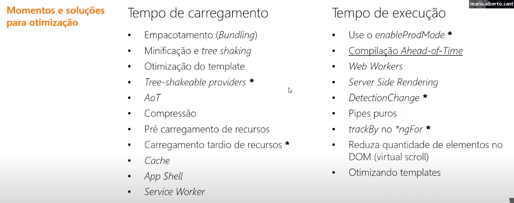
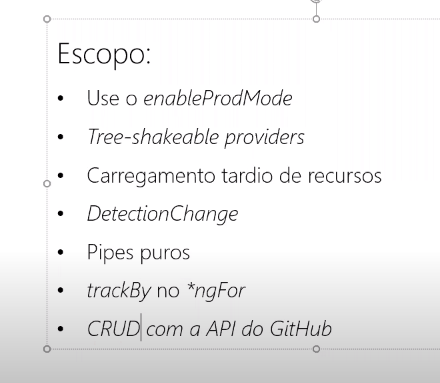

# Projeto requerimento para o curso Aceleração Global Dev #1

## Conceitos Avançados de performance e otimização usando Angular

### Projeto proposto :

Este projeto em Angular é uma continuidade do projeto desenvolvido no curso Conceitos Avançados de performance e otimização usando Angular . Requerimentos :

- Usar o enableProdMode (ok alterei environment.ts para production: true e hmr: false em starter-kit\src\environments\environment.ts )

- Tree-shakeable providers (providedIn) (ok)

- Carregamento Tardio de recursos (Lazy Load) (ok está sendo feito no about e no list example)

- Change Detection (ok está sendo feito no row-table nao sei se ainda é isso , acho que
  deveria ter só um botao e recarregar só os que tiveram mudanca )
  @Input() usuarios:any =[];/// o componente só sera renderizado novamente se essa variavel mudar

- (cada Row da Tabela deve ser um componente - Ngcontent )

- O avatar do user vai ser um componente que deve ter um input que deve usar o changeDetection on push
  (se a row alterar e o avatar nao alterar ele não renderiza o componente de novo )

- Pipes Puros (não houve tempo) (ok)

- trackBy no \*ngFor (ok)

- CRUD com a API do GitHub (foi utilizado o json server conforme sugestão do professor) (ok)

Para utilização é necessário ter o Angular instalado:

```
npm install -g @angular/cli
npm i @angular-devkit/build-angular
npm install -g typescript
```

Para utilizar realizar o CRUD deve-se ter o json-server instalado:

```
npm install -g json-server
cd src/db   (local onde o banco de dados está)
json-server --watch db.json
```

## O que queremos otimizar ?

- Tempo de carregamento
  tempo entre acessso e utilização
- Tempo de execução
  Melhoria no tempo de navegação e renderização dos elementos do DOM

Como o angular aborda otimização



- AOT é um assunto bom paara estudar depois

pwa = Progressive web app

web workers -> Front end multithread (evitar travamento do browser)

SSR- Compila no back e retorna só o dinamico

virtual scroll -> só carrega o que está visível na página

- colocou o nome das pastas como @ core e @ shared para ficarem sempre em primeiro na listagem de pastas

- enableProdMode() -> Otimiza para modo produção

- no main.ts

import { enableProdMode } from '@angular/core';

if (environment.production){
enableProdMode();
}

- no starter-kit\src\app\about\about-routing.module.ts
  const routes: Routes = [{
  path: '',
  component: AboutComponent,
  data: { title: marker('About') } }
  ];

## carregamento tardio de recursos

- construindo o modulo em bundles ( pacotes ) diferentes

lazy load -> O módulo será renderizado quando necessário, diminuindo assim o tempo de carregamento do main Isso é o ideal para partes pouco usadas ou que possam ser usadas depois, como o about. Vamos fazer isso com o about e trazer esse delay para o runtime.
Vc vai até o app.module.ts (bootstrap da aplicação), remove o módulo do @NgModule senão ele continuará sendo incluido no bundle

incluimos no routes. starter-kit\src\app\app-routing.module.ts

{
path: 'about',
loadChildren: () => import('./about/about.module').then((m) => m.AboutModule),
},

- nunca faça lazy load da rota inicial !
- lazy route de componente

## Change Detection

- OnPush : componente imutável só sendo mudado se o @input for mudado

- mudamos o header.component.ts

```Js
import { ChangeDetectionStrategy, Component, OnInit } from '@angular/core';
import { Router } from '@angular/router';

@Component({
  selector: 'app-header',
  changeDetection:ChangeDetectionStrategy.OnPush,
  templateUrl: './header.component.html',
  styleUrls: ['./header.component.scss'],
})
export class HeaderComponent implements OnInit {
  menuHidden = true;

  constructor(private router: Router) {}

  ngOnInit() {}

  toggleMenu() {
    this.menuHidden = !this.menuHidden;
  }

  logout() {}

  get username(): string | null {
    return null;
  }
}

```

- fazer um componente com change detection onPush
- EStudar input e output para trocar informações entre componentes 1:14:30

## Trackby

- vamos criar um novo modulo
- ng g m list-example --route listExample --module app.module

criou o modulo starter-kit\src\app\list-example
criou a rota no starter-kit\src\app\app-routing.module.ts

{ path: 'listExample', loadChildren: () => import('./list-example/list-example.module').then(m => m.ListExampleModule) },

- alteramos starter-kit\src\app\app-routing.module.ts para que pre carregue todos os módulos

@NgModule({
imports: [RouterModule.forRoot(routes, {preloadingStrategy:PreloadAllModules})],
exports: [RouterModule],
providers: [],
})
export class AppRoutingModule {}

- vamos criar um service dentro de list-example
- ng g service list-example/example-service

ele deve ser importado pelo starter-kit\src\app\list-example\list-example.module.ts

```JS
import { NgModule } from '@angular/core';
import { CommonModule } from '@angular/common';

import {ExampleServiceService} from './example-service.service'
import { ListExampleRoutingModule } from './list-example-routing.module';
import { ListExampleComponent } from './list-example.component';


@NgModule({
  declarations: [ListExampleComponent],
  imports: [
    CommonModule,
    ListExampleRoutingModule
  ],
  providers:[
    ExampleServiceService
  ]
})
export class ListExampleModule { }
```

o ideal teria sido criar uma pasta service e coloca-lo dentro da pasta service

- vamos usar uma service para listar repositorios do github

dentro do core tem uma rota que usaremos no example-service que ficará assim :

```JS

import { Injectable } from '@angular/core';

const routes = {
  quote: () => `/users`,
};

@Injectable({
  providedIn: 'root'
})
export class ExampleServiceService {

  constructor(private httpClient:HttpClient) { }
}
```

a classe QuoteService dentro do starter-kit\src\app\home\quote.service.ts está usando em seu contrutor um httpClient que usaremos

Obs: Control espaço importa automatimante o import

- http já está sendo importado na aplicação então é só usarmos

- Observable ?

- mudamos o environment e rerescrevemos o quote service para fazer um request aos users do github

export const environment = {
production: false,
hmr: true,
version: env.npm_package_version + '-dev',
gitHubUrl: '',
defaultLanguage: 'en-US',
supportedLanguages: ['pt-BR',en-US', 'fr-FR'],
};

```JS
import { HttpClient } from '@angular/common/http';
import { Injectable } from '@angular/core';
import { of } from 'rxjs';
import { catchError, map } from 'rxjs/operators';

const routes = {
  users: () => `/users`,
};
```

```JS
@Injectable({
  providedIn: 'root'
})
export class ExampleService {

  constructor(private httpClient:HttpClient) { }

  getUsers () {
    return this.httpClient.get(routes.users())
    .pipe(
      catchError(() => of('Error, could not load users'))
    );
  }

}
```

```Js
import { Component, OnInit } from '@angular/core';
import { ExampleService } from './example-service.service';

@Component({
  selector: 'app-list-example',
  templateUrl: './list-example.component.html',
  styleUrls: ['./list-example.component.scss']
})
export class ListExampleComponent implements OnInit {

  items = new Array(1000);
  constructor (private exampleService:ExampleService) { }

  ngOnInit(): void {
    this.exampleService.getUsers()
    .subscribe((users)=>{
        console.log(users);
    })
  }


```

Desafio :



Get ok
-o professor criou conosco
delete ok
-criei o componente delete list e sua rota
ng g m delete-list --route delete-example --module app.module

- criei o servico delete-list
- ng g service delete-list/delete-service
- adicionar no header
  Post ok
  -criei o componente delete list e sua rota
  ng g m post-list --route post-example --module app.module
- criei o servico post-list
- ng g service post-list/post-service
- adicionar no header
  Put ok
  -criei o componente put list e sua rota
  ng g m put-list --route put-example --module app.module
- criei o servico put-list
- ng g service put-list/put-service
- adicionar no header

-criei o componente row-table e sua rota
ng g m row-table --route row-table --module app.module

- criei o service dentro do row-table
  ng g service row-table/row-service

ou com Github ou local

- mapear o opbjeto de usuario em starter-kit\src\app\list-example\list-example.component.ts

-colocalo para dentro do services
starter-kit\src\app\list-example\example-service.service.ts

- tentei criar um json server

npm install -g json-server

- criei o arquivo db.json dentro da pasta db dentro de source
  json-server --watch db.json

dai vamos usar manipular esse usuario

npm install -g @angular/cli
npm i @angular-devkit/build-angular
npm install -g typescript

- https://api.github.com/users/1 retorna apenas o user com id 1

- fazer um fork e um pull request

- olhar o providedIn no exampleservice.service (nao utilizado nao faz parte do bundle )

- Lazy load

- Change detection (cada row da tabela seja um componente dica : Ngcontent)
  https://medium.com/mestre-angular/entenda-change-detection-no-angular-b5f2fdf65000
  https://medium.com/senior/criando-componente-angular-com-conteudo-dinamico-ng-content-82334babe134

- avatar do usuario vai ser um componente , que vai ter um input que vai usar onchange detenction push
  se a row alterar e o avatar nao alterar nao deve renderizar o componente de novo

- colocar a lista de usuários no service se não coinseguir usar o github

///https://medium.com/senior/criando-componente-angular-com-conteudo-dinamico-ng-content-82334babe134
https://medium.com/@joshblf/wtf-is-ng-content-8382b2a664e1
https://stackoverflow.com/questions/52994927/ng-content-select-not-working-element-is-not-a-known-element
